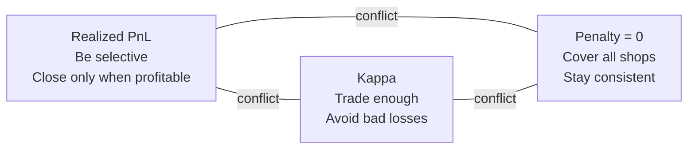

# SN-79: Realized PnL, Kappa, Penalty — and How the Forge Agent Controls Them

**Date:** 2026-06-11  
**Audience:** Operators tuning UID 158 (`deploy-forge-v2-1.7` / `forge-v2-1.0.0`) and related Ascend miners  
**Related code:** `taos/im/validator/reward.py`, `taos/im/utils/kappa.py`, `deployments/forge-v2-1.0.0/agents/`

**Document outline:** §1–4 metrics & validator math · §5–7 Forge agent & tunables · §8 prediction · §9–10 diagnostics · **§11 three-way tension (general logic + analogies)** · **§12 why custom agents failed (general principles)** · technical appendix in §12.10

---

## 1. Terminology: PnL vs Realized PnL vs `total_realized_pnl`

### 1.1 What “PnL” means in the dashboard

In agent-table metrics (`agents_*.json`), the fields **`pnl`** and **`inventory_value`** are the **same number**: current **mark-to-market** portfolio value across all 128 books.

```
inventory_value = base holdings × mid price + quote balance (+ collateral − loans)
```

**`pnl_change` / `inventory_value_change`** is how much that mark-to-market value moved since the previous snapshot.

| Field | Meaning | Used in validator score? |
|-------|---------|--------------------------|
| `pnl` / `inventory_value` | Unrealized + realized wealth right now | **No** (informational only) |
| `pnl_change` | Recent mark-to-market delta | **No** |
| `total_realized_pnl` | Cumulative profit/loss from **closed** round-trip legs | **Yes** (PnL score component) |

**Important:** You can have **positive `pnl`** (inventory worth more) while **`total_realized_pnl` is negative** — open positions may be up, but completed trades lost money after fees. Scoring cares about **realized** outcomes, not paper gains.

### 1.2 What “realized PnL” means

**Realized PnL** is profit or loss recorded when a trade **closes** an opposite open lot on the same book (FIFO matching).

When you **buy** and already have an open **short** lot → the match closes the short → **realized PnL**.  
When you **sell** and already have an open **long** lot → the match closes the long → **realized PnL**.

Validator logic (`_match_trade_fifo()` in `taos/im/neurons/validator.py`):

```
realized_pnl = (close_price − open_price) × matched_qty − open_fee − close_fee
```

(for a long; signs flip for shorts)

Each scoring interval, per-book realized PnL is appended to:

```
realized_pnl_history[uid][timestamp][book_id] = pnl
```

When a round-trip leg closes, **round-trip volume** (quote notional) is also recorded:

```
roundtrip_volumes[uid][book_id][timestamp] += qty × price
```

### 1.3 What `total_realized_pnl` is

**`total_realized_pnl`** in Prometheus/agent-table is the **lifetime cumulative sum** of all realized PnL across all books for that UID in the current simulation run. It only moves when FIFO matches occur — not when you place/cancel orders or hold open inventory.

- **`total_realized_pnl` going up** → completed round-trips are net profitable after fees  
- **`total_realized_pnl` going down** → completions are losing (adverse fills, taker crosses, insufficient edge, fee leak)  
- **Flat `total_realized_pnl`** → few completions, or completions break even  

There is no separate “per-interval realized_pnl” exported in the standard miner gauge; you infer velocity from snapshot deltas of `total_realized_pnl`.

---

## 2. What is Kappa (κ)?

### 2.1 Per-book κ₃ (raw `kappa` in metrics)

For each book, the validator builds a time series of **realized PnL per scoring interval** over a lookback window, then computes **Kappa-3** — a risk-adjusted return ratio.

Formula (`taos/im/utils/kappa.py`):

```
κ₃(τ) = (μ − τ) / LPM₃(τ)^(1/3)
```

| Symbol | Meaning |
|--------|---------|
| **μ** | Mean of normalized per-interval returns on that book |
| **τ** | Target threshold (typically 0 — breakeven) |
| **LPM₃** | Third **lower partial moment** — measures downside tail; **large losses hurt κ much more than small wins help** |

Returns are normalized by per-book MAD so κ is scale-invariant across price levels.

**Minimum data:** A book needs **≥ 3 non-zero realized-PnL observations** in the lookback window. Otherwise κ for that book is **undefined** (`None`).

The exported raw **`kappa`** field is an aggregate across books (often looks small, e.g. 0.01–0.03, before normalization).

### 2.2 `kappa_score` (the scoring number)

Raw per-book κ values are **not** used directly. `calculate_kappa_score()` in `reward.py` transforms them:

1. **Normalize** each book’s κ to [0, 1]  
2. Multiply by **activity factor** (round-trip volume vs cap; decay when idle)  
3. Optionally multiply by **PnL factor** per book  
4. Allow up to **37.5%** of books to have no κ without counting them  
5. Apply **outlier penalty** (see §3)  
6. Take the **median** across scored books → **`kappa_score`** (~0.50 is strong)

**Trading score blend:**

```
TradingScore ≈ 0.79 × kappa_score + 0.21 × pnl_score
```

(`kappa.weight` and `pnl.weight` from validator config; defaults shown are typical.)

### 2.3 Why κ and realized PnL are linked but not identical

Both derive from the **same FIFO realized-PnL history**, but:

| Metric | Emphasis |
|--------|----------|
| **total_realized_pnl** | Absolute dollars (or quote units) summed |
| **κ₃** | **Quality** of the return stream — mean vs downside volatility |
| **kappa_score** | Median κ across books, activity-weighted, penalty-adjusted |

You can lose money on average (bad `total_realized_pnl`) with decent κ if losses are small and rare, but in practice **profitable completions** usually improve both.

---

## 3. What is Penalty (`kappa_penalty`)?

**`kappa_penalty`** is the **outlier penalty** subtracted from the median activity-weighted κ. It is **not** a separate fee — it punishes **inconsistent performance across books**.

### 3.1 Outlier penalty (primary `kappa_penalty`)

After computing activity-weighted normalized κ per book, the validator:

1. Collects all scored book values into array `data`  
2. Computes Q1, Q3, IQR = Q3 − Q1  
3. Finds **left outliers**: books with κ far below the pack (`< Q1 − 1.5 × IQR`)  
4. If outlier median < 0.5:

```
base_penalty = (0.5 − median(outliers)) / 1.5
consistency_bonus = 1 − exp(−5 × IQR)
outlier_penalty = base_penalty × consistency_bonus
```

5. **`kappa_score = max(median(data) − outlier_penalty, 0)`**

**Interpretation:** If you trade well on 100 books but **several books are dead or terrible**, penalty > 0 and `kappa_score` drops.

**To keep `kappa_penalty = 0`:** Every book you touch should perform **near your median** — no “forgotten” cold books with zero activity and no κ, and no books where you repeatedly realize losses.

### 3.2 Inactive-book penalty (related, not always labeled separately)

If **more than 37.5%** of books (48 of 128) have **no valid κ**, the excess inactive books are scored as **0.0** in the median calculation — effectively dragging `kappa_score` down even if `kappa_penalty` exports as 0.

This is why top miners rotate across **all 128 books** with `inactive_book_frac=0`.

---

## 4. How metrics are calculated (validator pipeline)

```
Miner instructions (limit / cancel / market)
        ↓
Simulator matching engine (fills, rejects)
        ↓
FIFO position ledger → realized_pnl per fill
        ↓
Every scoring interval (~5 sim seconds):
  realized_pnl_history[uid][ts][book] += pnl
  roundtrip_volumes[uid][book][ts] += notional
        ↓
kappa_3()  → per-book raw κ
calculate_kappa_score() → kappa_score, penalty
calculate_pnl_score()   → pnl_score from realized PnL sums
        ↓
TradingScore = weighted sum → incentives
        ↓
Prometheus / agent_table export:
  kappa, kappa_score, kappa_penalty, total_realized_pnl, pnl, ...
```

### 4.1 PnL score (21% weight)

`calculate_pnl_score()`:

1. Sum **realized PnL per book** over lookback  
2. Convert to **return vs allocated capital** (`miner_wealth / 128`)  
3. Allow inactive books (same 37.5% tolerance)  
4. **Median** across books  
5. Map to **[-0.5, +0.5]** (0 = breakeven)

So **`total_realized_pnl` growth directly feeds `pnl_score`**, but through a normalized, median-aggregated lens.

### 4.2 Activity factor (feeds κ, not a separate gauge)

Per book, round-trip volume vs cap:

```
volume_cap = capital_turnover_cap × miner_wealth   (default cap ≈ 10× wealth)
activity_factor = 1 + (volume / volume_cap) × impact   (capped at 2.0)
```

Inactive books **decay** toward 0 over time after a grace period — another reason to keep trading every book regularly.

---

## 5. Deploy-forge-v2 (`AscendForgeAgent`, UID 158)

### 5.1 What runs in production

| Item | Value |
|------|-------|
| **Bundle** | `deployments/forge-v2-1.0.0/` |
| **Run script** | `./run_deploy_forge_v2.sh` |
| **PM2** | `79-turboforgev2` |
| **UID** | 158 |
| **Agent class** | `AscendForgeAgent` (thin wrapper) |
| **Deployed profile** | **`surge`** (via `miner.env`, overrides default `forge`) |
| **Release** | `forge-ascend-2.0.0` |

`AscendForgeAgent.py` only sets `default_ascend_profile = "forge"`. Production uses **`ascend_profile=surge`** in `AGENT_PARAMS`.

### 5.2 Architecture

```
AscendForgeAgent
      ↓
AscendAgent (FinanceSimulationAgent)
      ↓  onTrade() → requote hints after every maker fill
      ↓  respond() → ascend_score_tick() in competitive_utils.py
      ↓
FinanceAgentResponse → validator
```

**Critical:** `AscendAgent` hooks **`onTrade`**. When you get a passive fill, it stores `(book_id → opposite side, fill_price)` as a **requote hint**. Next tick, `ascend_score_tick` prioritizes **completing that round-trip** at sufficient edge. Custom agents that skip this hook bleed PnL.

### 5.3 Surge profile parameters (UID 158 production)

From `_PROFILE_DEFAULTS["surge"]` in `_ascend_agent_base.py`:

| Parameter | Surge value | Role |
|-----------|-------------|------|
| `max_books_per_tick` | 12 | Books actively quoted per tick |
| `max_total_instructions` | 29 | Global instruction cap |
| `book_rotation_groups` × `rotation_windows` | 11 × 10 | Rotate which books are active each cadence |
| `min_spread_ticks` | 2.5 | Skip tighter books |
| `min_rt_edge_ticks` | 3.0 | Minimum round-trip edge to enter |
| `min_completion_rt_edge_ticks` | 4.5 | Minimum edge to **complete** after a fill |
| `min_quote_rt_edge_ticks` | 3.5 | Edge required for new quotes |
| `touch_join_spread_ticks` | 3.0 | Join touch when spread wide enough |
| `two_sided_wide_ticks` | 4.5 | Two-sided quotes on very wide books |
| `inactive_book_frac` | **0.0** | **Never skip books** (penalty control) |
| `cold_book_volume_threshold` | 50.0 | Identify under-traded books |
| `max_cold_books_per_tick` | 7 | Force quotes on cold books |
| `inventory_skew_soft` / `hard` | 0.0016 / 0.0035 | Flatten before inventory hurts completions |
| `expiry_period` | 180s (GTT) | Stale orders expire |

Compared to **`rocket`** (UID 65): surge is slightly **more conservative** on edges (3.0/4.5 vs 2.5/4.0) — fewer but cleaner round-trips.

---

## 6. How `ascend_score_tick` controls each metric

Each tick, `ascend_score_tick()` runs **ordered phases**. Below: what each phase does for **`total_realized_pnl`**, **`kappa_score`**, and **`kappa_penalty`**.

### Phase 0 — Book filtering

Books must pass:

- Spread ≤ `max_spread_ratio`  
- Spread ≥ `min_spread_ticks`  
- Round-trip edge ≥ `min_rt_edge_ticks`  
- Tape imbalance ≤ `max_tape_imbalance`  
- Maker fee ≤ `max_fee_rate`  

**Effect:** Skips toxic/tight books → **protects realized PnL** and κ (avoids lossy RTs). Cold fallback relaxes filters slightly so some books still qualify.

### Phase 1 — Cancel stale orders

Removes resting orders far from touch.

**Effect:** Prevents adverse fills after the market moves → **stops realized PnL bleed**.

### Phase 2 — Requote / completion (highest priority for PnL)

Uses **`requote_hints`** from `onTrade`:

1. After your maker fill, queue opposite-side completion  
2. Require completion edge ≥ `min_rt_edge_ticks`; prefer ≥ `min_completion_rt_edge_ticks` (4.5 surge)  
3. Price at **inside spread** or **join touch** depending on edge  
4. Respect inventory skew caps  

**Effect:** This is the **main engine for positive `total_realized_pnl`**. Each successful completion adds fee-aware profit to realized history → improves κ numerator and PnL score.

### Phase 3 — Flatten skewed inventory

Books with `|skew| ≥ inventory_skew_soft` get flatten orders (inside; cross only at `inventory_skew_hard`).

**Effect:** Prevents inventory from blocking completions; reduces forced bad exits → **stabilizes κ** (fewer large LPM₃ hits).

### Phase 4 — Touch-join (fill rate + activity)

On rotating books with wide spread, join best bid/ask with microprice direction bias.

**Effect:** Generates **maker fills** → triggers Phase 2 requotes → **round-trip volume** for activity factor; profitable completions raise **`total_realized_pnl`**.

### Phase 5 — Inside quotes (rotation)

Microprice-gated single-sided inside quotes on rotating books. Cold-book bonus ranks under-traded books higher.

**Effect:** Maintains **128-book coverage** → **`kappa_penalty = 0`**; generates RT opportunities.

### Phase 6 — Cold-book sweep

Explicitly targets books with `traded_volume < cold_book_volume_threshold`.

**Effect:** Directly addresses **penalty** — ensures every book accumulates ≥3 κ observations. Uses conservative inside quotes.

### Phase 7 — Two-sided wide quotes

When spread ≥ `two_sided_wide_ticks` and skew ≈ 0, place both bid and ask inside.

**Effect:** Higher fill rate on wide books with balanced risk → volume + potential profitable RTs.

### Summary table — Forge/surge logic → metrics

| Goal | Primary mechanisms |
|------|-------------------|
| **`total_realized_pnl` ↑** | Requote completions at ≥4.5 tick edge; GTT expiry; flatten before forced losses; fee cap |
| **`kappa_score` ↑** | Profitable RT stream (high μ, low LPM₃); activity boost from volume |
| **`kappa_penalty = 0`** | `inactive_book_frac=0`; cold-book sweep; rotation 11×10 across 128 books; no outlier dead books |
| **`pnl` (mark-to-market)** | Not targeted directly; side effect of balanced inventory |

---

## 7. Tunables (`miner.env` → `AGENT_PARAMS`)

| Param | Effect on realized PnL | Effect on κ / penalty |
|-------|------------------------|----------------------|
| `ascend_profile` | Selects edge/spread defaults | surge vs rocket trade-off |
| `min_completion_rt_edge_ticks` | Higher → fewer but safer completions | Higher → better κ, less volume |
| `min_rt_edge_ticks` | Entry filter | Affects which books get data |
| `max_books_per_tick` | More books → more RTs | More coverage → lower penalty risk |
| `cancel_all_on_startup=1` | Clears stale orders after restart | Prevents restart PnL bleed |
| `min_quantity` / `max_quantity` | Size of each leg (0.32 standard) | Volume vs impact |
| `expiry_period` | GTT TTL (180e9 ns = 180s) | Stale quote protection |

**Do not tune blindly:** Lower edges raise volume but often **destroy `total_realized_pnl`** (seen on failed custom agents).

---

## 8. Can prediction help? How to integrate it

### 8.1 Where prediction adds value

The Ascend engine already uses **heuristic “signals”**:

- **Microprice** vs mid → short-term direction for quote side  
- **Tape imbalance** → filter toxic one-sided flow  
- **Inventory skew** → risk overlay  

A prediction model can replace or augment these with:

| Use case | Prediction target | Integration point |
|----------|-------------------|-------------------|
| **Direction gate** | Sign of next-interval return | Override microprice in touch/quote phases |
| **Spread selection** | Probability of profitable completion | Skip books where model predicts adverse move |
| **Completion timing** | Expected time to mean reversion | Widen/narrow `min_completion_rt_edge_ticks` dynamically |
| **Cold-book prioritization** | Expected fill rate | Rank `cold_jobs` instead of lowest-volume first |
| **Risk-off trigger** | Volatility / toxicity score | Set `risk_off` earlier than skew count |

### 8.2 Where prediction hurts

| Risk | Why |
|------|-----|
| **Adverse selection** | Touch-join fills often mean price moves against you; wrong directional bet amplifies losses |
| **Latency** | Model inference adds response time → fewer instructions processed |
| **Sim-to-real gap** | `SimpleRegressorAgent` features (OHLCV) may not match competitive sim dynamics |
| **κ requires realized closes** | Predicting direction without disciplined completion still fails scoring |
| **Over-trading** | More signals → more fills → more fees if edge insufficient |

Historical note: Example ML agents (`SimpleRegressorAgent`) are **educational**, not competitive out of the box. UID 65/158 success comes from **execution discipline**, not raw prediction accuracy.

### 8.3 Recommended integration pattern (overlay on Ascend, not replacement)

**Do not replace `ascend_score_tick`.** Extend `AscendAgent`:

```python
class AscendPredictAgent(AscendAgent):
    def respond(self, state):
        self._update_predictions(state)  # fill self._book_bias: dict[int, float]
        return super().respond(state)
```

Pass bias into `ascend_score_tick` via existing **`direction`** dict or a new optional `book_bias` parameter:

1. **Train offline** on validator logs / sim replays: features = spread, microprice, OFI, depth; target = next-tick mid return or completion PnL  
2. **At runtime**, compute `bias[book_id] ∈ [-1, +1]`  
3. **Gate quotes:** only BUY if `bias > threshold` AND microprice agrees  
4. **Veto touch-join** when `|bias|` is high but disagrees with intended side  
5. **Keep** requote completion logic unchanged — completions are where PnL is realized  

Reference implementation paths in this repo:

| File | Purpose |
|------|---------|
| `agents/SimpleRegressorAgent.py` | Online sklearn regressor, feature pipeline |
| `taos/im/agents/ai/regressor.py` | `FinanceSimulationAIRegressorAgent` base |
| `doc/gentrx/` | GenTRX prediction training (separate 10% incentive pool) |

### 8.4 Practical prediction roadmap

1. **Phase A — Logging:** Record per-book features + fill outcomes + realized PnL per completion (extend `validator_exchange_log.py` pattern).  
2. **Phase B — Offline labels:** Label “was this fill followed by profitable completion within N ticks?”  
3. **Phase C — Veto layer:** Model blocks new quotes when predicted completion EV < 0; Ascend still completes existing inventory.  
4. **Phase D — Rank layer:** Re-rank `touch_jobs` / `cold_jobs` by predicted EV.  
5. **Phase E — Validate on test UID:** Require 24h of `kappa_penalty=0`, rising `total_realized_pnl`, non-None κ before production switch.

**Expected benefit:** Moderate improvement in **realized PnL per round-trip** and fewer outlier books — **not** a substitute for rotation, cold-book sweep, or completion edge gates.

---

## 9. Quick diagnostic guide

| Observation | Likely cause | Forge/Ascend lever |
|-------------|--------------|-------------------|
| `total_realized_pnl` falling | Loss completions, taker crosses, low edge | Raise `min_completion_rt_edge_ticks`; check GTT |
| `kappa` = None | <3 RT observations per book | Cold-book sweep; lower rotation period |
| `kappa_penalty` > 0 | Outlier books much worse than median | Increase cold-book quotes; fix dead books |
| `pnl` up, `total_realized_pnl` flat | Open inventory MTM gain, no closes | Normal; wait for requote completions |
| High volume, bad PnL | Touch-join without completion discipline | Ensure `onTrade` requote path active |
| Score 0 after deploy | κ not populated yet | Wait for lookback window (~hours sim time) |

---

## 10. Reference metrics (healthy Ascend miner, T1312 snapshot)

| UID | Agent | kappa_penalty | kappa_score | total_realized_pnl |
|-----|-------|---------------|-------------|-------------------|
| 65 | AscendPulseAgent (rocket) | 0 | ~0.505 | +11,640 |
| 158 | AscendForgeAgent (surge) | 0 | ~0.502 | +9,317 |
| 196 | HybridRealizedAgent (realized) | None | None | −7,838 (recovering) |

---

## 11. The three coupled goals — general logic (why they pull apart)

### 11.0 Plain-language picture

Imagine you run **128 small shops** (one per “book”) in a busy market. The validator grades you on three things at once:

| Goal | Plain question | Everyday analogy |
|------|----------------|------------------|
| **Realized PnL** | Did you **actually cash in** profit on completed buy-sell cycles (after fees)? | Shopkeeper’s **bank balance from closed deals** — not unsold stock on the shelf |
| **Kappa (κ)** | Were those cash-ins **steady and safe**, not lucky wins mixed with big losses? | **Report card on quality** — good average *and* few bad days; one disaster ruins the grade |
| **Penalty = 0** | Did **every shop** perform roughly as well as your typical shop — not just your best locations? | **Franchise audit** — you cannot ignore weak stores; one terrible outlet drags the whole brand |

All three read the **same history of closed trades**. But each metric **cares about a different aspect** of that history. That is why “do the right thing for one metric” often **hurts** another.

**Central idea:** You are not optimizing one number. You are balancing **profit**, **quality**, and **uniformity** — and the market makes those hard to get together.

---

### 11.1 What each goal really asks for

**Realized PnL — “Did you make money when you finished a round trip?”**

- Only **completed** trades count (buy then sell, or sell then buy, matched and closed).
- Open inventory can look valuable on paper (`pnl` / `inventory_value` in the dashboard) but **does not** score until you close.
- Logic: **Be picky about when you ring the cash register.** Skip deals where fees eat the margin.

**Kappa — “Was your trading *good*, not just *busy*?”**

- Needs **enough closed trades per shop** to judge you (minimum sample size — in SN-79, at least three meaningful observations per book in the lookback window).
- Rewards **steady positive closes** and **punishes bad losses heavily** (losses count more than wins in the risk formula — the “LPM₃” effect).
- Also rewards **staying active** — if you stop trading a shop, your activity score for that shop fades.
- Logic: **Trade enough to be measured, but never take ugly losses to “get data.”**

**Penalty = 0 — “Are all your shops in line with each other?”**

- The validator takes the **median** across shops — one amazing shop cannot fully save ten awful ones.
- Shops you **ignore** or shops where you **lose repeatedly** become “outliers” and trigger a penalty.
- You may skip some shops briefly, but only up to a limit (~37.5% of all books); beyond that, ignored shops count as zeros and hurt you.
- Logic: **Show up everywhere regularly**, and do not let any single shop become a disaster zone.

---

### 11.2 Why three good intentions conflict

At first it sounds like one strategy should work: *“Trade everywhere, close only when profitable.”*  
In practice, **the market fights back**:

1. **Shops that need your attention** (for penalty) are often **bad shops to trade** (for PnL) — tight margins, one-sided flow, you get filled when price moves against you.
2. **Kappa needs proof you traded** (samples + activity) but **also punishes losses more than it rewards wins** — so waiting forever is bad, but closing in a hurry at a loss is worse.
3. **Penalty needs consistency** — you cannot only work your ten best shops and ignore the rest.

So the three goals pull in **different directions**:



**General rule:**  
- **Selectivity** helps PnL but hurts penalty (ignored shops).  
- **Broad participation** helps penalty but hurts PnL (you touch weak shops).  
- **Activity** helps kappa’s sample size but increases the chance of **bad fills** (hurts kappa and PnL).

Kappa sits in the **middle**: it wants both **quality** (like PnL) and **enough trading** (like penalty). That is why kappa is the hardest to “game” with a single simple rule.

---

### 11.3 Conflict A — “Be everywhere” vs “Only trade good deals”

**Penalty logic:** The auditor wants every shop visited on a schedule. Empty or terrible shops trigger a penalty.

**PnL logic:** A rational trader skips shops where the spread and fees mean **no realistic profit** on a round trip.

**Why they oppose:** The shops most in danger of being “ignored” are often the **hardest** to profit from. Showing up there means placing quotes that **get filled for the wrong reason** (price moving against you) — you satisfy “presence” but **lose money on the close**.

**Failure pattern (general):**  
A **“presence lane”** that says *“quote on every lagging shop to avoid penalty”* without the same **profit rules** as the main strategy. You fix attendance but **bleed realized PnL** on exactly those weak shops.

**Failure pattern (other side):**  
Trade only **20 easy shops** and ignore the rest. PnL on those 20 may look fine, but **too many ignored shops** → penalty or median collapses toward zero.

**Balanced logic (what successful agents do):**  
Rotate through **all** shops, but use **different intensity** — show up on cold shops with **safer** quotes (inside the spread, stricter edge), not “any fill at any cost.”

---

### 11.4 Conflict B — “Close winners” vs “Generate enough data”

**PnL logic:** Wait until a close is **clearly profitable after fees** before completing the round trip.

**Kappa logic:** You need **enough completed round trips per shop** in the scoring window to even receive a grade. If you never close, you have **no score** (κ = None).

**Kappa risk logic:** One **forced loss** on a close hurts your risk grade **more** than many small wins help — like one F on a report card outweighing several B’s.

| Action | Bank balance (realized PnL) | Risk grade (kappa) |
|--------|----------------------------|---------------------|
| Many small profitable closes | Goes up steadily | Good — stable positive record |
| One forced loss to “unstick” inventory | Drops | **Bad** — disproportionate risk hit |
| Never close — hold inventory | Flat (no realized change) | **No grade** — not enough finished deals |
| Lots of volume, slightly losing each time | Steady bleed | **Worst** — bad average *and* bad risk |

**Why they oppose:**  
- **Patient** closing → good PnL per trade, but **slow** kappa if you rarely finish.  
- **Aggressive** closing → enough samples, but **losses** destroy kappa and PnL.  
- **Aggressive quoting** → fills and volume, but **adverse selection** (you get hit when price moves against you).

**General insight:** High **turnover** with slightly **negative** edge is worse than moderate turnover with **positive** edge. Volume alone is not a strategy.

---

### 11.5 Conflict C — “Stay active” vs “Stay safe”

Kappa and penalty both reward **activity** (trading volume, regular participation). Activity usually means **placing quotes that get filled**.

In competitive markets, **fills are not random**:

- You often get filled when **others know something you don’t** (price about to move — *adverse selection*).
- The more aggressively you **join the best bid/ask** to get volume, the more often this happens.

So the **same behavior** (trade more, join the touch) helps **penalty and activity** but **hurts PnL and kappa** when the edge is thin.

| Strategy | Penalty / coverage | PnL / kappa quality |
|----------|-------------------|---------------------|
| Trade aggressively everywhere | Good attendance | High loss risk |
| Trade only when edge is wide | Miss weak shops | Good per-trade economics |
| Rotate all shops, strict close rules | Good compromise | Needs careful tuning |

---

### 11.6 One shop, three philosophies (general example)

Same shop, hard conditions (tight spread, fees eat margin, flow is one-sided):

| Philosophy | Penalty | Realized PnL | Kappa |
|--------------|---------|--------------|-------|
| **A. Skip it** | Bad if many shops skipped | Safe (no losses) | No data — cannot grade |
| **B. Always quote to get fills** | Shop stays “active” | Small repeated losses | Bad — losses dominate |
| **C. Visit on schedule, quote only when margin exists, close only when profitable** | Shop gets periodic activity | Losses avoided | Slow but healthy record |

Failed custom strategies often mixed **B on entry** (force activity) with **A on exit** (never close at a loss) → **losses without clean completions**, or inventory stuck with **no kappa data**.

---

### 11.7 Fourth constraint — the median (no single hero)

Even if you excel on half your shops, the validator uses the **median** — typical shop performance — not the average of your best shops.

**General logic:** You cannot run **10 perfect flagship stores** and **118 neglected ones**. The grade reflects **typical** performance. Penalty = 0 is a **consistency** test, not a checkbox for “I traded somewhere today.”

---

### 11.8 How successful agents resolve the tension (general design)

Winning agents do not pick one goal. They use a **priority order** each tick:

1. **Finish profitable round trips** after you get filled (protect PnL and kappa quality).  
2. **Reduce risky inventory** before it forces a bad close (protect kappa from big losses).  
3. **Quote for fills** only where spread and rules allow edge (volume without suicide).  
4. **Rotate and revisit cold shops** so none are forgotten (penalty control).  
5. **Cancel stale quotes** so old prices do not turn into surprise losses.

Different **profiles** (e.g. rocket vs surge vs realized) only change **how strict** each step is — not the goals themselves. That is **engineering the overlap zone**, not choosing one metric to maximize.

**SN-79 mapping (for reference):** This priority order is what `ascend_score_tick` implements; parameters like `min_completion_rt_edge_ticks` and `inactive_book_frac=0` tune how wide the overlap is.

---

### 11.9 Summary — general logic table

| Tension | One side says… | Other side says… | Root cause |
|---------|----------------|------------------|------------|
| Penalty vs PnL | Visit every shop | Only trade good shops | Weak shops need presence but lose money |
| Kappa vs PnL | Close enough to be graded | Close only when profitable | Patience vs sample size |
| Kappa vs Penalty | Stay active on weak shops | Keep all shops equally good | Activity on bad shops → losses |
| Volume vs quality | More fills | Better fills | Adverse selection |

**One sentence:** The validator rewards **profitable, steady, franchise-wide** market making — not maximum volume, not perfect shops only, and not paper profits on open inventory.

---

## 12. Why custom agents failed — general logic (despite knowing the rules)

Teams had the **formulas and rules written in code comments** — kappa, penalty, realized PnL, minimum samples, median aggregation. Results still failed. That gap is explained by **general principles**, not missing documentation.

### 12.1 Knowing the rules ≠ playing the game well

**Analogy:** You can read every rule in chess and still lose because you lack **opening theory, tactics, and time management**.

Same here:

| Level | What it gives you |
|-------|-------------------|
| **Know the scoring formula** | Understand *what* is measured |
| **Run a working strategy** | Know *when* to quote, *when* to close, *when* to skip — under pressure, every tick, on 128 books |

Custom agents **documented** the validator logic but **rebuilt** the trading loop from scratch. Proven agents **inherited** a loop tuned through many deploys. The rules were the same; the **execution discipline** was not.

---

### 12.2 Three goals assigned to two strategies (Hybrid’s structural mistake)

**General mistake:** Splitting one problem into two agents/lanes:

- **Lane 1:** “Keep penalty at zero” → quote everywhere, minimum size, force activity.  
- **Lane 2:** “Grow PnL / kappa” → smarter signals, stricter edge.

**Why this fails in general logic:** §11 shows the three goals **already conflict**. Putting “penalty work” in one lane and “profit work” in another **does not remove the conflict** — it **hides** it. The presence lane pays the penalty bill with **realized losses** while the alpha lane tries to recover on a subset. Net: **high volume, negative realized PnL, no kappa**.

**Better general design:** **One decision pipeline** with ordered priorities (§11.8), not two competing objectives per tick.

---

### 12.3 Minimum sample size — why “busy” was not enough

**General logic:** Kappa is a **statistical grade**. You need **enough finished round trips per shop** in the grading period. One busy weekend at flagship stores does not grade the whole chain.

Custom agents often:

- Traded **heavily on some books** but **barely on others** (subset deployment or slow rotation).  
- **Opened** many positions but **did not close** them profitably (strict hold → no samples).  
- **Closed at a loss** often enough that the “grade window” was poisoned before three clean samples accumulated.

**Plain result:** Dashboard shows **high volume**, metrics show **`kappa = None`** — “insufficient evidence” or “evidence is mostly bad.”

---

### 12.4 Common loss paths (general mechanisms)

These are not SN-79-specific bugs — they are **recurring market-making failure modes**:

| Loss path | General mechanism | What breaks |
|-----------|-------------------|-------------|
| **Forced exit** | “Stuck too long — close at market to free capital” | Realized loss; kappa risk spike |
| **Stale quote** | Old order fills after market moved | Fill at bad price; loss on close |
| **Activity without edge** | Quote to get volume on weak shops | Death by small losses + fees |
| **Adverse selection** | Join best price; get filled when price moves against you | Loss on completion |
| **Restart amnesia** | Process restarts; forgets cost basis of inventory | Wrong close targets |
| **Two-speed rules** | Strict on profit lane, loose on presence lane | Losses where you forced attendance |

Custom Kappa/Hybrid agents hit several of these at once — hence **`total_realized_pnl` falling** while **`pnl` (inventory)** could still look okay temporarily.

---

### 12.5 Architecture gap (general: framework vs homemade adapter)

**General pattern:**

| Approach | Typical outcome |
|----------|-----------------|
| **Extend proven base** (hooks on fill, shared tick engine, tuned defaults) | Inherits compromise from §11.8 |
| **Rewrite loop in a thin adapter** | Easy to miss fill→complete chain, rotation, cancel hygiene |

**Fill → complete chain (general logic):** When someone trades against your resting order, the **next decision** should usually be “how do I **close this round trip profitably**?” Proven stacks wire that as an **automatic priority**. Standalone reimplementations often treat fills as **events to log** rather than **triggers to complete** — so inventory and losses accumulate.

---

### 12.6 Environment: you are not alone in the market

Even perfect pseudocode loses if the **environment** is hostile:

- ~250 other agents compete on each book.  
- **Touch** quotes get filled when others are faster or better informed.  
- Edge parameters are a **narrow band**: too loose → bleed; too tight → no fills → no kappa.

**General lesson:** Parameters are not derived from formulas alone; they are **calibrated in competition** (profiles like rocket/surge).

---

### 12.7 Ops failures amplify strategy failures

**General logic:** Bugs and downtime do not just pause trading — they cause **wrong trading** after recovery (stale orders, wrong inventory accounting). Strategy and ops are one system.

Examples seen in deployment: crash loops, dropped instructions, missing logs → hours of **unobserved** loss accumulation.

---

### 12.8 Outcomes in plain terms (UID 196 vs working miners)

| Pattern | UID 196 (custom → recovery) | UID 65 / 158 (Ascend) |
|---------|----------------------------|------------------------|
| Realized PnL | Large ** cumulative loss** on closed trades | **Positive** cumulative closed PnL |
| Kappa | **No grade yet** (None) | **Stable score** ~0.50 |
| Penalty | **No stable zero** while broken | **0** |
| Volume | **Very high** | High but **quality-controlled** |

**One-line diagnosis:** UID 196 optimized **activity and presence** without the **same profit discipline on every shop** — the classic failure mode of §11.

---

### 12.9 What to do instead (general design rules)

1. **Do not maximize one metric** — engineer the **overlap** (§11.8).  
2. **One pipeline, ordered priorities** — not separate “penalty lane” and “profit lane.”  
3. **Every fill triggers a completion plan** — close logic is not optional.  
4. **Same edge rules on cold shops and hot shops** — intensity may differ, **loss tolerance** must not.  
5. **Extend what works** — change parameters and overlays, not the whole tick loop.  
6. **Validate on metrics that matter:** rising **`total_realized_pnl`**, **`kappa_penalty = 0`**, non-null **`kappa_score`** — not volume alone.

---

### 12.10 Technical appendix (SN-79-specific detail)

The following maps the general logic above to this subnet’s implementation — for engineers tuning deploys.

<details>
<summary>Click to expand: formulas, agent names, and code paths</summary>

**Formulas:** κ₃ = (μ − τ) / LPM₃^(1/3); penalty via 1.5×IQR outlier rule; ≥3 non-zero realized-PnL observations per book; median aggregation; 37.5% inactive tolerance.

**Custom agents (retired on UID 196):** `AscendKappaAgent`, `HybridResilientAgent`, `MicrostructureEdgeAgent` via `_sn79_compat.py`.

**Proven path:** `Ascend*Agent` → `AscendAgent` → `ascend_score_tick()` in `competitive_utils.py`; `onTrade` requote hints.

**Hybrid-specific loss paths:** presence lane / `behind_floor`, `COMPLETION_STUCK_TICKS`, `HARD_STUCK` taker unwind, GTC without expiry, `_flatten_skew` without edge, OFI override, PM2 restart ledger drift.

**Reference snapshots:** T0617–T1312 agent_table; UID 196 `total_realized_pnl` ≈ −4k to −7.8k; UID 65/158 positive with `kappa_penalty = 0`.

</details>

---

*Sources: `taos/im/validator/reward.py`, `taos/im/utils/kappa.py`, `deployments/forge-v2-1.0.0/agents/_ascend_agent_base.py`, `competitive_utils.py` (`ascend_score_tick`), `SN-79-extra-questions.md`, `SN-79-scoring-and-agents.md`, agent_table snapshots.*
